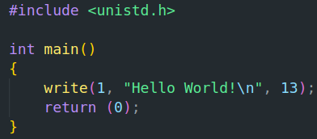
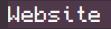
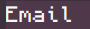

### Hey, I'm Alan ;)

<h3> 👨🏻•💻 About Me </h3>

- 🤔 &nbsp; Exploring new technologies, and developing.

- 🎓 &nbsp; Studying at Epitech Montpellier, currently in second year.

- 🌱 &nbsp; Learning about Rust programming language, and algorithms.

- ✍️ &nbsp; Pursuing Developement, I want to try new things to see what interests me the most.

<h3>🛠 Tech Stack</h3>

- 💻 &nbsp; C | C++ | Python | Haskell

- 🌐 &nbsp; HTML | CSS | Vue.js | Js

<!--

- 🛢 &nbsp; MySQL

- 🔧 &nbsp; Git | Markdown

- 🖥 &nbsp; Word | Excel | PowerPoint | Photoshop

-->

<h3>🛠 To Learn</h3>

- 🔧 &nbsp; Rust | Ruby | Perl | Go

<h3> 🤝🏻 Contact Me </h3>

 

